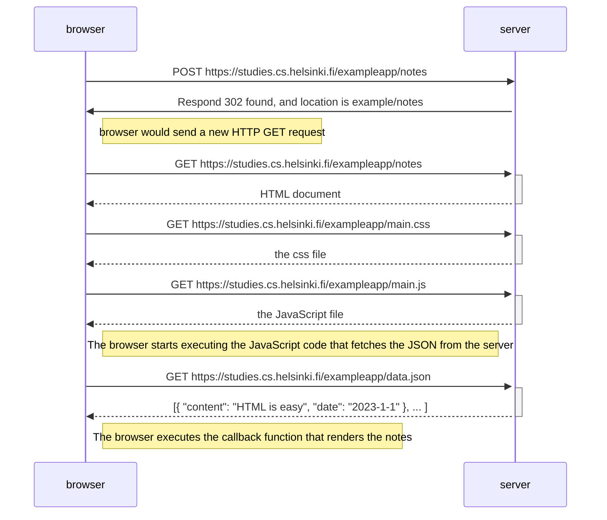
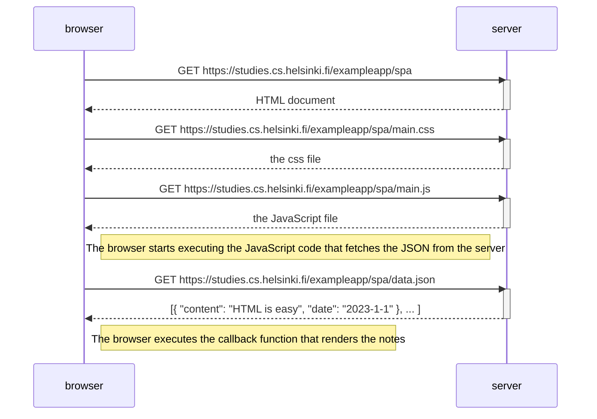
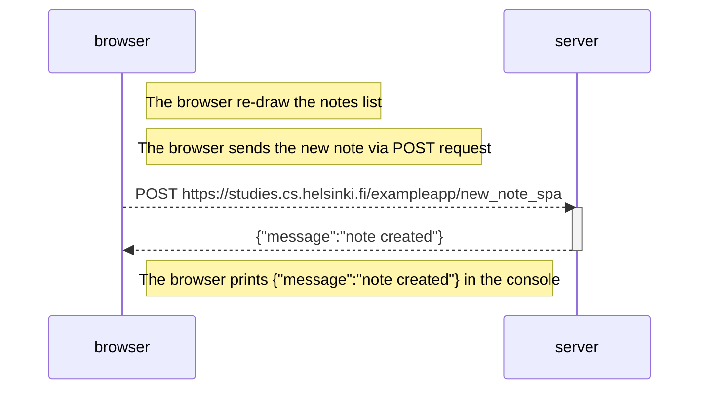

# 0.4

Here's what I think happened after I wrote something in the text field and clicked the Save button:


From the network tab, after clicking the Save button, first of all the browser sent the post data by POST method and got a response with status code 302, and the location is `exampleapp/notes`. This should mean that the browser would send a new HTTP GET request to `https://studies.cs.helsinki.fi/exampleapp/notes`, which is why the follow ing sequence is the same as just sending HTTP GET to this URL.


# 0.5  
For going to the single page app (sending HTTP GET / visiting the url) seems to have the same process:

First of all the server respond with a `spa` page:
```html

<!DOCTYPE html>
<html>
<head>
  <link rel="stylesheet" type="text/css" href="/exampleapp/main.css" />
  <script type="text/javascript" src="/exampleapp/spa.js"></script>
</head>
<body>
  <div class='container'>
    <h1>Notes -- single page app</h1>
    <div id='notes'>
    </div>
    <form id='notes_form'>
      <input type="text" name="note"><br>
      <input type="submit" value="Save">
    </form>
  </div>
</body>
</html>
```
and then the browser would send 2 HTTP GET requests, one for `/exampleapp/main.css` and another for `/exampleapp/spa.js`.
The difference seems to be, the javascript file `spa.js`. In this script the behavior of clicking Save button seems different. I particularly noticed this part:
```javascript
var redrawNotes = function() {
  var ul = document.createElement('ul')
  ul.setAttribute('class', 'notes')

  notes.forEach(function (note) {
    var li = document.createElement('li')

    ul.appendChild(li);
    li.appendChild(document.createTextNode(note.content))
  })

  var notesElement = document.getElementById("notes")
  if (notesElement.hasChildNodes()) {
    notesElement.removeChild(notesElement.childNodes[0]);
  }
  notesElement.appendChild(ul)
}

var sendToServer = function (note) {
  var xhttpForPost = new XMLHttpRequest()
  xhttpForPost.onreadystatechange = function () {
    if (this.readyState == 4 && this.status == 201) {
      console.log(this.responseText)
    }
  }

  xhttpForPost.open("POST", '/exampleapp/new_note_spa', true)
  xhttpForPost.setRequestHeader("Content-type", "application/json")
  xhttpForPost.send(JSON.stringify(note));
}

window.onload = function (e) {
  var form = document.getElementById("notes_form")
  form.onsubmit = function (e) {
    e.preventDefault()

    var note = {
      content: e.target.elements[0].value,
      date: new Date()
    }

    notes.push(note)
    e.target.elements[0].value = ""
    redrawNotes()
    sendToServer(note)
  }
}

```
First of all the page jsut re-draw the notes list immediately, it add the new note to the `notes` array and calls the `redrawNotes()`:
```javascript
notes.push(note)
e.target.elements[0].value = ""
redrawNotes()
```
Then it calls `sendToServer(note)` to send the note to the server via POST request. And the server also behaves differently. When I clicked the Save button, the response I got from the server seems to have a HTTP status code of `201 created`, and the page is not refreshing since it's not redirecting me to anywhere. It simply prints `{"message":"note created"}` in the console.

# 0.6  
So from what I learned in exercise 0.5, after the user types new note in the text area and click the `save` button, this should be what the diagram looks like:
